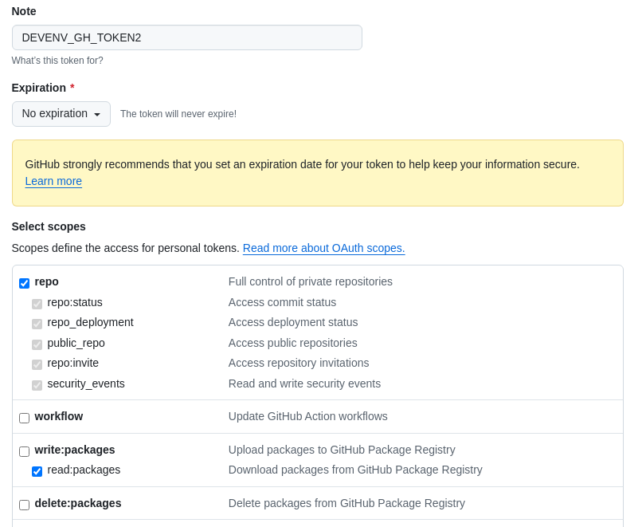

# DEVENV (Developer Environment) repo

This repository is the starting point for setting up a working dev environment for working at WorkInProgress.ai.  It provides the tooling necessary to do development on all other repos.  

See the sections below for instructions on how to set up your dev environment.

## Prerequisites

- Git
- Visual Studio Code (with the Remote - Containers extension installed)
- A unix environment (Linux, MacOS, WSL)
- Docker (instructions for installing docker are given below under the sections for each environment)

You do not need to have any additional tooling installed on your host machine.  Everything you need will be provided in the dev container.  Although it is not prohibited to use a different editor or IDE for development, Visual Studio Code and the dev environment provided here are considered the standard.  Use of VS Code and this dev environment is _required_.  (see the section on [lone wolf options](./docs/Dev-container-environment.md#lone-wolf-options))

## Setup of the dev environment

### Windows

Note:  Windows is the most complex environment to set up.  You should properly hate it, and prefer something else.  A Windows machine will need significantly more resources than a Linux or MacOS machine.  An option to consider is to run Linux in a VM instead.

1. Install the WSL2 on Windows.  This is a feature that allows you to run a Linux environment on Windows.  You can find instructions [here](https://docs.microsoft.com/en-us/windows/wsl/install).    
2. Install a Linux distro from the Microsoft Store.  Ubuntu 22.04 is recommended.  Log in and verify that it runs. 
3. Configure the WSL with sufficient resources.  This is done in the `.wslconfig` file in your user directory (`C:\Users\[user name]`).  The following is a recommended configuration:
   ```
   [wsl2]
   memory=12GB
   processors=4
   ```
   You can adjust this to suit your system, but that is the recommended minimum.  After making the changes, restart the WSL2 environment by exiting the terminal and restarting it.
4. Install Docker Desktop for Windows, using WSL2 as the backend.
5. Make sure that Docker is configured to expose it's command line to WSL2.  This is done in the Docker Desktop settings.
6. Clone this repo into your WSL2 environment.
   `git clone git@github.com:workinprogress-ai/devenv.git`  
7. In the WSL terminal, navigate to the repo directory `devenv`
   `cd devenv`
8. Run the [setup script](#running-the-setup-script).  This will ask you a few questions about your environment and allow you to specify your SSH key to the private repos.
   `./setup`
9. Once the setup script is complete, navigate back to the root of the repo and run Visual Studio Code, pointing it at the repo directory.
   `code .`
10. VS Code should, after a few seconds, offer to reopen the folder in a container.  If not, open the command palette (Ctrl+Shift+P) and run the command `Remote-Containers: Reopen in Container`.
11. The dev container will build and start.  This may take a few minutes the first time.  Subsequent starts will be faster.  Once the bootstrap has run, and the container output log shows that it is opening ports. Close VS Code and re-open it, or select Reload Window from the command palette. 
12. Reopen Visual Studio Code and the folder in the dev container.  Once again you will be asked if you want to open the folder in a dev container.   Choose to do so, or you can manually open it in the container.  
13. The dev container will start.  You can now start working on the code.

### MacOS

1. Install [Docker Desktop for Mac](https://docs.docker.com/desktop/install/mac-install/).
2. In a terminal, clone this repo.
   `git clone git@github.com:workinprogress-ai/devenv.git`  
3. In the terminal, navigate to the repo directory `devenv`
   `cd devenv`
4. Run the [setup script](#running-the-setup-script).  This will ask you a few questions about your environment and allow you to specify your SSH key to the private repos.
   `./setup`
5. Once the setup script is complete, navigate back to the root of the repo and run Visual Studio Code, pointing it at the repo directory.
   `code .`
6. VS Code should, after a few seconds, offer to reopen the folder in a container.  If not, open the command palette (Ctrl+Shift+P) and run the command `Remote-Containers: Reopen in Container`.
7. The dev container will build and start.  This may take a few minutes the first time.  Subsequent starts will be faster.  Once the bootstrap has run, and the container output log shows that it is opening ports. Close VS Code and re-open it, or select Reload Window from the command palette.  
8. Reopen Visual Studio Code and the folder in the dev container.  Once again you will be asked if you want to open the folder in a dev container.   Choose to do so, or you can manually open it in the container.  
9. The dev container will start.  You can now start working on the code.

### Linux

1. Install Docker.  You may use the script [here](https://get.docker.com) to install Docker on your system.
2. Clone this repo.
   `git clone git@github.com:workinprogress-ai/devenv.git`  
3. In the terminal, navigate to the repo directory `devenv`
   `cd devenv`
4. Run the [setup script](#running-the-setup-script).  This will ask you a few questions about your environment and allow you to specify your SSH key to the private repos.
   `./setup`
5. Once the setup script is complete, navigate back to the root of the repo and run Visual Studio Code, pointing it at the repo directory.
   `code .`
6. VS Code should, after a few seconds, offer to reopen the folder in a container.  If not, open the command palette (Ctrl+Shift+P) and run the command `Remote-Containers: Reopen in Container`.
7. The dev container will build and start.  This may take a few minutes the first time.  Subsequent starts will be faster.  Once the bootstrap has run, and the container output log shows that it is opening ports. Close VS Code and re-open it, or select Reload Window from the command palette.   
8. Reopen Visual Studio Code and the folder in the dev container.  Once again you will be asked if you want to open the folder in a dev container.   Choose to do so, or you can manually open it in the container.  
9. The dev container will start.  You can now start working on the code.

## Running the setup script

The [setup script](./host-utils/setup) will ask you a few questions about your environment and allow you to specify your SSH key to the private repos.  It will also install the necessary tools on your host machine to work with the dev container.  The script saves your answers to a hidden folder in the local repo `.setup` and will not ask you the same question twice if you have already run it previously and provided answers.  If you want to run `setup` from the beginning, simply delete any files from the `.setup` folder.  

The script will ask you for the following information:

* Your name:  This is the name by which you will be identified in all commits.  
* Your workinprogress.ai email:  This identifies you by email in all commits. 
* Your timezone:  This is in order to correctly display your local time within the container.  By default, the script will attempt to determine your time zone.  If it does so correctly, then you can just hit ENTER and accept the default. 
* A github SSH key:  This is for use when dealing with repository remotes.  The script will help you to create one if you do not already have one.  You will need to add the public part of the key to your [github settings](https://github.com/settings/keys). 
* A github PAT:  The Personal Access Token is what allows package access and other functions from the dev environment. You can create one by going in github to Settings -> Developer Settings -> Personal Access Tokens -> Classic and click on [the link to create a new token](https://github.com/settings/tokens/new).  The recommended note should be 'DEVENV_GH_TOKEN' and the expiration should be 'No Expiration'.  (Note:  An argument could be made that storing the PAT in plain text is a security risk.  If you are concerned about this, feel free to delete the `github_token.txt` file once the container comes on line.)  This token should have the following access:
   - repo (all)
   - read:packages
   - read:org



## Creating the Dev Container

There is a first time procedure to execute to set up the container the first time. Container configuration and setup is handled in two parts:  There is a configuration that defines the basic container setup (the [devcontainer.json](./../.devcontainer/devcontainer.json) file) and a subsequent script that is run once the container is up.

1) In VS Code, open the repository root folder.  Once VS loads it, you should see a message come up that asks if you want to open it in a dev container.  Click on the button to re-open the folder in a dev container.  Alternatively if you do not get asked to open it in a dev container, you can tell VS explicitly to do so. From the command pallette choose "Dev Containers:  Open Folder in Container..."  Choose the repository root folder.

2) Once VS opens the folder in a container, the container itself will be created.  The first run will take longer as the container is built.  After that, container start-up should be almost instantaneous.

3) After the container finishes building, shut down VS Code and give it a few seconds for the container to fully shut down.  When `docker ps` shows no containers running, reopen VS and you should be good to go.

NOTE:  Be careful that the container has finished building before you shut down VS Code.  This isn't always super clear by looking at the log.  When the log gets to where ports are being forwarded (see example), you are usually good to go.

```
[74284 ms] Port forwarding 43888 > 44963 > 44963 stderr: Connection established
[79289 ms] Port forwarding 43888 > 44963 > 44963 stderr: Remote close
[79295 ms] Port forwarding 43888 > 44963 > 44963 terminated with code 0 and signal null.
```

## More information

For more information see [The Development Environment](./docs/Dev-container-environment.md) section of the documentation. 

## Coding documentation

* [The development environment](./docs/Dev-container-environment.md)
* [Coding Standards](docs/Coding-standards.md)
* [Contributing](docs/Contributing.md)
* [Culture](docs/Culture.md)
* For information about services in general, go to the [Services core libraries repo](https://github.com/workinprogress-ai/lib.services.core).
* For information about specific services, look at the README for the service. 

## Reference

* [VS Code Remote Containers](https://code.visualstudio.com/docs/remote/containers)
