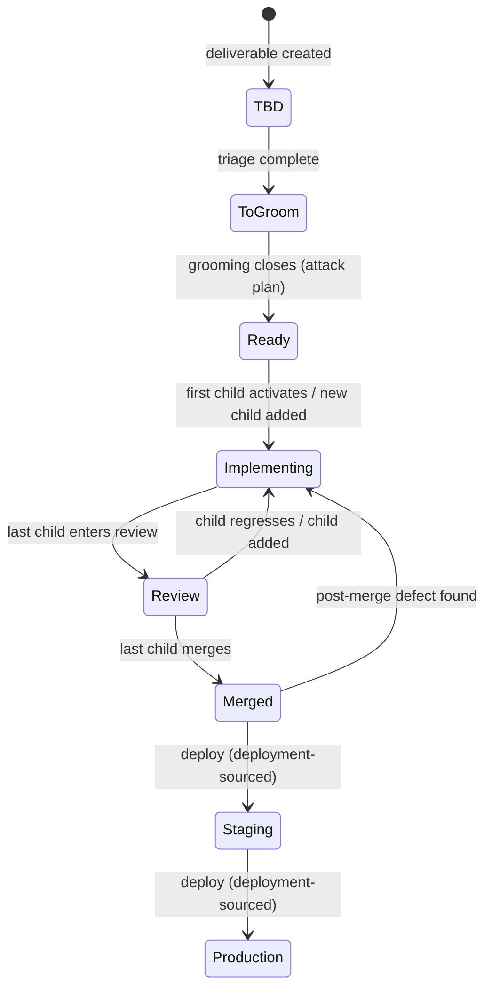
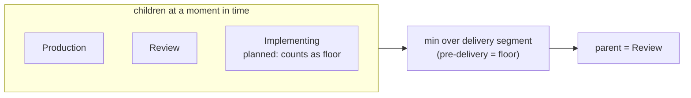
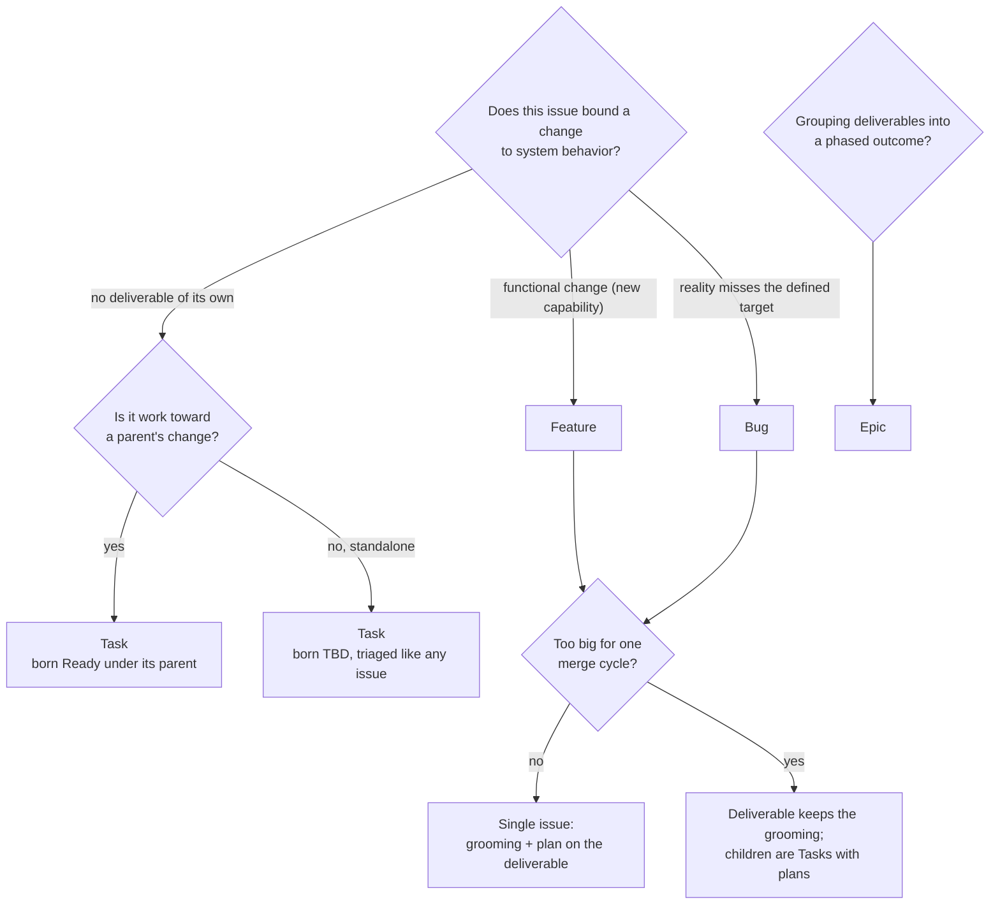

# Issue Workflow

This is the canonical guide to how work flows through issues in this organization: what our issue types mean, how work decomposes, how status is derived and propagated, and who (or what) moves a card. Every other document that touches workflow defers to this one. The generalizable methodology behind this model is documented as the *Derived Status Rollup* pattern in the engineering pattern library (`docs.engineering`, Work Management Patterns).

## The model in one paragraph

Issues carry one of four **types** that describe their **delivery role**: Features and Bugs bound change (functional change, or alignment with the defined target state); Tasks bound work toward someone else's change; Epics group deliverables into phased outcomes. Status lives on a single ordered column, and it means **current state, never history** — cards can regress. For decomposed work, the parent's status is **derived from its children** and written automatically: nobody updates a parent card by hand. Everything is driven by local tooling: skills, wrappers, and the `workflow-signal` command fire events; the workflow engine resolves them, writes the cards, and propagates.

## Issue types

| Type | Bounds | Examples |
| --- | --- | --- |
| **Feature** | A functional change, described from the receiving boundary's perspective — whoever receives the change at the boundary being shipped to | "Users can reset their password from the login page" |
| **Bug** | Alignment: the system's target state says X, reality misses the mark | "Password reset emails arrive with a broken link" |
| **Task** | A unit of work toward someone else's change-bound description; individually mergeable (code) or individually actionable (non-code) | "Add the reset endpoint to the identity service" |
| **Epic** | A grouping of issues constituting a larger phased deliverable; it orchestrates, it does not deliver | "Q4: self-service account recovery" |

Rules that keep the types honest:

- **Deliverables never nest within their own type.** A Feature with a Feature child contradicts the parent's boundary: if the child is itself a deliverable, the parent wasn't the delivery boundary.
- **Tasks may nest.** Work with no deliverable of its own is a Task regardless of size or position — a large non-deliverable effort is a Task parent decomposing into Task children. (A Task parent is not an Epic: Epics group *deliverables*; Task parents top decomposed *work*.)
- **Leaves are Tasks or undecomposed Features/Bugs.** A small functional change is one Feature carrying both its grooming and its implementation plan; a large one keeps the grooming on the Feature and spawns Task children, each with its own plan. Bugs are symmetric: small bugs live as a single issue; big bugs decompose into Tasks.
- **The "user" is the receiving boundary**, not per-repo engineers. A service capability that ships dormant because the frontend isn't ready has not delivered the Feature — it has completed a Task.

## Status vocabulary

One ordered vocabulary, sourced from `devenv.config [workflows]` (forks restyle it there; nothing else changes):

```text
TBD → To-Groom → Ready → Implementing → Review → Merged → Staging → Production
```

Two halves with different owners:

- **Workflow states (TBD → Review):** advanced by *work signals* — the skills and tools that do the work fire events as it progresses.
- **Deployment states (Merged → Production):** advanced by *deploys*. Until deploy observers are wired, use `workflow-signal staging-deploy <issue>` / `workflow-signal production-deploy <issue>` when a deploy lands. States past Merged are never reached by workflow signals.

Statuses are **revocable current-state**. A merged feature whose review discovered a defect goes back to Implementing — the card tells you where the work *is*, not where it has been.

## What moves a card

| Transition | Fired by |
| --- | --- |
| TBD → To-Groom | `issue-triage --triage-complete` (backlog triage wizard/CLI) |
| To-Groom → Ready | grooming skill closes (`_on_end_grooming`); planning approvals hold Ready |
| Ready → Implementing | implementation skills begin (`_on_begin_implementation`); **or derived**: first child to activate puts the parent here |
| Implementing → Review | PR opens (`pr-create-for-merge` → `_on_begin_review`); implementation skills end |
| Review → Merged | merge completes (`pr-merge-pull-request` / `pr-complete-merge` → `_on_merge`) |
| Merged → Staging → Production | deploys — `workflow-signal` until observers exist |

The full event catalog is `workflow-signal --list`. Manual corrections at any boundary: `workflow-signal <event> <issue>...`, or just `workflow-signal` for the interactive "What happened?" picker.

## Derived status: how parents track children

When work is decomposed, the parent card is **computed from its children and written** — a pure function of current child states, no memory:

1. **All children pre-delivery** (TBD/To-Groom/Ready): the parent keeps its own workflow state. A freshly groomed Feature sits at Ready while its tasks wait.
2. **Any child in delivery** (Implementing and beyond): the parent equals the **minimum child state**, where pre-delivery children count as Implementing.

Parent resolution reads the **native sub-issue graph** first, falling back to the legacy `Part of #N` body-text line for issues linked before native linking existed. On those older subtrees the body-text line is load-bearing: removing it from an issue's body silently stops parent rollup for that subtree.

The rule is stateless, so every edge falls out of it:

| Children | Parent | Why |
| --- | --- | --- |
| Ready, Ready, Ready | Ready (own state) | nothing in delivery yet |
| Implementing, Ready, Ready | Implementing | first activation; unplanned children floor at Implementing |
| Implementing, Implementing, Review | Implementing | parent waits for its slowest child |
| Merged, Merged, Review | Review | last child to merge moves the parent |
| Production, Review, Merged | Review | the weakest delivery child is the parent's truth |
| Review, *new Ready child linked* | Implementing | a late child pulls the parent back — decomposition means the work isn't done |
| Implementing (regressed), Merged | Implementing | review sent one child back; the parent follows |
| Production, Staging | Staging | the bug is *fixed* when the last child reaches Production |





Two consequences we accept by design:

- **A parent reads Merged until every child reaches Production.** Conservative, and the progress queries show per-child deploy state.
- **Concurrent merges can thrash a parent for seconds** before the next event heals it. No locking; self-healing.

### Forcing and cascade

Forcing a parent to a **delivery state** (`workflow_apply_status ... parent` / cascade tooling) writes that state to all children once, authoritatively — the forced write does not re-derive. **Workflow states cannot be forced**: TBD/To-Groom/Ready/Implementing/Review advance only by their own signals; a card that says Ready earned it.

### What cannot move a card

- The web UI merge button fires nothing (no local code runs) — statuses changed outside local tooling are yours to maintain.
- Boards whose Status vocabulary differs from the configured one (application boards, e.g. product kanbans) don't participate; the engine ignores their values.
- No event exists for a thing until its observer does — deploy states were dormant until `workflow-signal` gave them a front door.

## Type and nesting decisions



## Worked example: a cross-repo feature

*A new "download all my data" capability.* One **Feature** is created (TBD) describing the user-visible behavior. Grooming produces an attack plan: identity-service endpoint (Task), storage-layer blob packing (Task), a Bug in the notification service uncovered along the way (child Task — the fix is instrumental to the Feature, so it is a Task here, not a Bug child), web app page (Task). Each Task is born **Ready** with its own plan. The Feature goes Ready when grooming closes.

The identity endpoint finishes first: its PR opens (Task → Review), merges (Task → Merged), and deploys to production (Task → Production). The Feature? Still **Implementing** — dormant capability, exactly right; users can't download anything yet. The notification fix merges; still Implementing. The last Task — the web page — reaches Review, and the Feature finally reads Review; when it merges, the Feature is Merged. When the release carrying all of them deploys, `workflow-signal production-deploy <feature>` (or the future deploy observer) puts the Feature in Production: delivered.

Along the way, a defect review sends the web page back to Implementing — the Feature regresses with it. Two weeks later someone links a missed storage Task under the Feature: the parent, sitting in Review, pulls back to Implementing. The card never lies about where the work is.

## The signal map

```mermaid
flowchart LR
    subgraph sources [who fires events]
        skills[Skills: grooming, planning,<br/>implementation, review]
        prtools[PR tools: create-for-merge,<br/>merge wrappers]
        triage[issue-triage CLI/wizard]
        manual[workflow-signal<br/>manual + interactive]
        deployobs[deploy observers<br/>future]
    end
    sources --> dispatcher["_on_* entry points<br/>→ workflow engine"]
    dispatcher --> resolve["resolve: event → status<br/>(config vocabulary + mapping)"]
    resolve --> write["write: project fan-out<br/>--all-projects --safe"]
    write --> propagate["propagate:<br/>parent rollup / cascade / recompute"]
    propagate -->|"climb on change"| write
```



Everything is local: your `gh` authentication, your machine. Signals are best-effort (a failed write never blocks work) and idempotent (re-signaling heals drift). Skills never know status vocabulary, project names, or where cards live — they know event names, and the engine does the rest.

## Related

- *Derived Status Rollup* — the methodology as a generalizable pattern (engineering pattern library, `docs.engineering` → Work Management Patterns; referenced, not linked: the pattern library lives in a separate repo)
- [Forking Guide](./Forking.md) — the customization contract for `status_workflow`: which tokens are load-bearing, what must change together when renaming
- [Additional Tooling](./Additional-Tooling.md) — per-command reference: `workflow-signal`, `issue-triage`, `project-list-for-issue`, `project-update-issue`
- `devenv.config [workflows]` — the vocabulary source of truth
- `tools/config/skill-events.yml` — the event → status mapping
