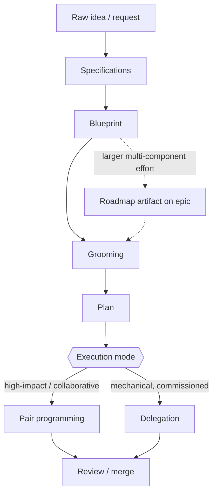
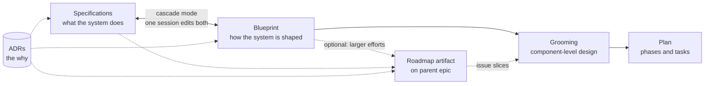
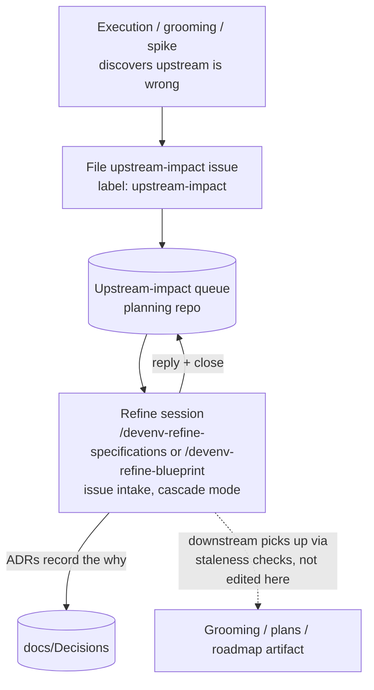
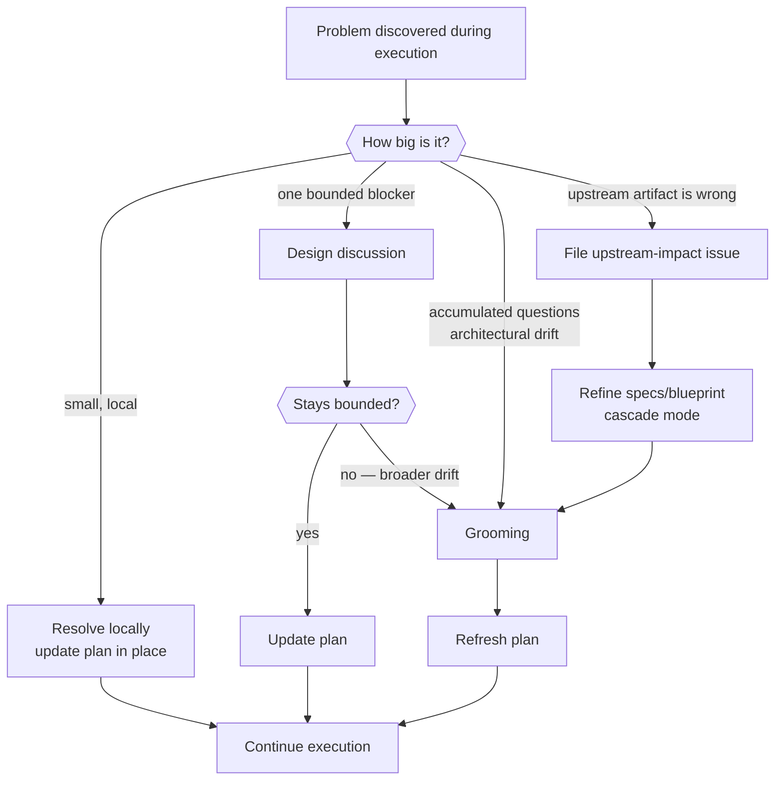
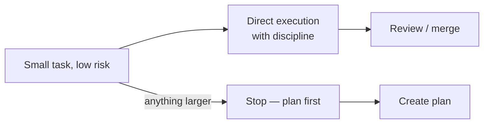

# Workflow Guide

This document describes the delivery methodology used in this workspace.

The workflow stands on its own regardless of who is doing the work: a human engineer, an AI assistant, or a mix of both. The Devenv skills are one way to carry out this workflow consistently, but they are not the workflow itself.

Use this guide when you want the end-to-end methodology rather than a tool catalog.

## Principles

- **Top-down delivery** — start with the highest-level artifact that makes sense for the work, then flow downward through the stack of increasingly specific artifacts.
- **Execution mode by risk and collaboration needs** — choose the right execution mode (collaborative vs delegated) based on the work's impact, novelty, and need for human involvement
- **Responsibility and Accountability** — the **engineer** is **always** the **responsible** party for the work, even when AI-assisted; the AI provides support but does not own outcomes.  "The AI did it" is not an acceptable explanation for a shipped change.  
- **Plans follow the engineer** — plans are current-state execution artifacts, not prescriptive contracts. The engineer drives; the plan is continuously reconciled to what actually happened. When reality diverges from the plan, update the plan (with confirmation whenever intent is ambiguous) so it reflects truth rather than forcing behavior.
- **A plan starts theoretical and ends as-built** — at creation a plan is the *theoretical* way to implement; during and after execution it is kept current so that at completion it records the *actual* way the work was *really* implemented. A completed plan is therefore a trustworthy as-built record for upstream artifacts (grooming documents, blueprints) to reconcile against.
- **Three homes for three questions** — living documents (specifications, blueprints, roadmaps) carry the target state (*what it is*), ADRs carry the rationale (*why*), git and issue-edit history carry the chronology (*when*). No artifact carries another home's content.
- **Attribution is human-only** — artifact authorship and revision entries attribute work to the current user/engineer (or team/repo context), never to the AI or a specific model. Historical notes describe changes, not model actors.
- **Organic comprehension** - Take the danger of comprehension deficit seriously.  Understand what you are doing and be able to explain it. Do not treat the AI as a black box or a magic wand.  If you don't understand something, ask questions, seek clarification, and do not proceed until you have a clear mental model.
- **AI is a tool, not a teammate** — use the AI for what it's good at (drafting, summarizing, suggesting) but do not treat it as a human collaborator with agency or ownership. Always maintain human control and oversight.
- **Decision gates are hard stops** — when execution raises a decision that must be resolved before continuing, no mutating action happens until the engineer explicitly approves the path. Silence or generic "go ahead" navigation is not approval.
- **Durable artifacts use durable names** — long-lived repository artifacts (files, classes, methods, tests, docs) must be named for stable domain concepts or behavior families, not transient execution labels (phase, step, milestone, task). If a transiently named scaffold is unavoidable, mark it with DEVENV and schedule explicit cleanup before completion.
- **Do the hard thing** - resist the temptation to skip steps or take shortcuts.  If you don't understand something, work at it until you do.  Choose to do work you are tempted to delegate when there is a good reason to do so.
- **Think deeply** - don't just ask "what should I do?" but also "why am I doing this? What is the goal? What are the trade-offs? What could go wrong? What would a good outcome look like?"  What patterns can be applied?
- **Move slow to move fast** - take the time to do things right, especially in the early stages of understanding and planning.  This will pay off in faster execution and better outcomes later on.

## Core idea

The workflow moves downward through a stack of increasingly specific artifacts:

```text
Idea / request
  -> Specifications
  -> Blueprint
  -> Grooming
  -> Plan
  -> Execution
  -> Review / merge
```

Each layer answers a different question:

- Specifications: what should the system do?
- Blueprint: how should the system be structured at the system level?
- Grooming: what is the component-level design direction, and what is the issue attack plan (Feature/Fix/Task by repo, independently shippable slices)?
- Plan: what are the executable phases and tasks for one selected issue slice?
- Execution: build and validate the work.

Durable issue-backed artifact note:

- Grooming artifacts and plans may be persisted as deterministic GitHub issue comment artifacts rather than issue-body text.
- When an issue holds multiple plans, each plan is a separate artifact selected by `doc_id`.
- The issue description remains general context; it is not the canonical storage location for plans.

The important rule is that you do not skip to a lower layer when the uncertainty still belongs to an upper layer.

## Default delivery flow

This is the normal happy path.

```text
Raw idea / request
   |
   v
Specifications
   |
   v
Blueprint
   |
   v
Grooming
   |
   v
Plan
   |
   +--> Execution: collaborative / high-impact mode
   |
   +--> Execution: delegated / mechanical mode
           |
           v
      Review / merge / follow-up feedback
```

In Devenv, the usual skill mapping is:

- Specifications -> `/devenv-write-specifications`
- Blueprint -> `/devenv-create-blueprint`
- Grooming -> `/devenv-grooming`
- Plan -> `/devenv-create-plan`
- Collaborative execution -> `/devenv-pair-programming`
- Delegated execution -> `/devenv-delegation`
- Review / merge -> `/devenv-pre-commit`, `/devenv-open-pr`, `/devenv-address-pr-comments`

Supporting view: the same happy path with Devenv skill support looks like this:

```text
Raw idea / request
  |
  v
Specifications
  |   supported by: /devenv-write-specifications
  v
Blueprint
  |   supported by: /devenv-create-blueprint
  v
Grooming
  |   supported by: /devenv-grooming
  v
Plan
  |   supported by: /devenv-create-plan
  v
Execution
  |   supported by: /devenv-pair-programming
  |              or /devenv-delegation
  v
Review / merge / follow-up feedback
      supported by: /devenv-pre-commit
                 -> /devenv-open-pr
                 -> /devenv-address-pr-comments
```

Read this as tool support layered onto the workflow, not as a replacement for the workflow itself.

## Alternative delivery flows

There are a few variations on the default flow that are still valid but less common. Some examples:

### A design discussion is needed to resolve one bounded blocker during grooming

```text
[ upstream steps ] 
       |
       v
   Blueprint
       |
       v
**Design discussion**
       |
       v
   Grooming
       |
       v
[ downstream steps ]
```

Or ...

```text
                      [ upstream steps ] 
                              |
                              v
**Design discussion(s)** -> Blueprint
                              |
                              v
**Design discussion(s)** -> Grooming
                              |
                              v
                      [ downstream steps ]
```

### One or more spikes are needed to understand something that will go into grooming

```text
            [ upstream steps ]
                   |
                   v
                Blueprint
                    |
                    v
**Spike(s)** -> Grooming
                    |
                    v
            [ downstream steps ]
```

### A bug or isolated feature directly leads grooming

Optionally with or without a spike or design discussion:

```text
**Spike(s)** -> Grooming
                    |
                    v
            [ downstream steps ]
```

### A bug or *small* feature directly leads to a plan

Optionally with or without a spike or design discussion:

```text
**Spike(s)** -> Plan
                    |
                    v
            [ Implementation ]
```

### Working without a plan

In cases of *very small* and very well understood work, it's possible to execute directly without a plan.  This should be done with caution.  A plan helps both the implementation and also to later understand the work that was done.

## Choose the execution mode

Once a plan exists, execution branches by risk and collaboration needs.

```text
Plan exists?
  |
  +-- no  --> Create or refine the plan first
  |
  +-- yes --> Is the work high-impact, novel, or strongly collaborative?
                |
                +-- yes --> Collaborative execution
                |
                +-- no  --> Delegated / mechanical execution
```

Methodologically:

- Use collaborative execution when the human should stay tightly involved in decisions.
- Use delegated execution when the work is mostly mechanical and review can happen at larger checkpoints.

In Devenv, that usually maps to `/devenv-pair-programming` vs `/devenv-delegation`.

Planning guardrail:

- If plan creation discovers scope/risk too large for one issue, route back to grooming for redivision into smaller independently shippable issues, then resume planning on one selected slice.

Supporting view with skill selection:

```text
Plan exists?
  |
  +-- no  --> /devenv-create-plan
  |
  +-- yes --> Is the work high-impact, novel, or strongly collaborative?
                |
                +-- yes --> /devenv-pair-programming
                |
                +-- no  --> /devenv-delegation
```

## Plan problems during execution

When execution reveals that the plan or design is wrong, route by problem size and blast radius.

```text
Execution discovers a problem
  |
  +-- Small local problem / question
  |      |
  |      +--> Resolve locally
  |      +--> Update the plan in place
  |      +--> Continue execution
  |
  +-- Single large blocker / design question
  |      |
  |      +--> Focused design discussion
  |      +--> Update the plan
  |      +--> Continue execution
  |
  +-- Accumulated questions / architectural drift
  |      |
  |      +--> Return to grooming
  |      +--> Re-settle the design direction
  |      +--> Refresh the plan
  |      +--> Continue execution
  |
  +-- Upstream architecture artifact is wrong
         |
         +--> File an upstream-impact issue in the planning repo
         +--> Refine specs/blueprint in cascade mode (refine skill)
         +--> Then flow back down through grooming and plan refresh
```

Rule of thumb:

- One bounded blocker that should change only a limited slice of the plan: use a focused design discussion.
- Multiple entangled questions, broader design drift, or likely sweeping plan redesign: return to grooming.
- If architecture is already settled and only tasks/phases need to change: refresh the plan.

In Devenv, the usual mapping is:

- Small local issue -> stay in `/devenv-pair-programming` or `/devenv-delegation`
- Focused design discussion -> `/devenv-design-discussion`, then `/devenv-refine-plan`
- Broader reshaping -> `/devenv-grooming`, then `/devenv-refine-plan`
- Upstream architecture change -> file an upstream-impact issue, then `/devenv-refine-blueprint` (or `/devenv-refine-specifications`) in cascade mode, then grooming and plan refresh

Supporting view with skill mapping:

```text
/devenv-pair-programming or /devenv-delegation
  |
  v
Problem discovered in the plan or design
  |
  +-- Small local problem / question
  |      -> stay in the execution skill
  |
  +-- Single large blocker / design question
  |      -> /devenv-design-discussion
  |      -> /devenv-refine-plan
  |      -> back to execution
  |
  +-- Accumulated questions / architectural drift
  |      -> /devenv-grooming
  |      -> /devenv-refine-plan
  |      -> back to execution
  |
  +-- Upstream architecture artifact is wrong
         -> file an upstream-impact issue (any skill can discover)
         -> /devenv-refine-blueprint or /devenv-refine-specifications (cascade mode)
         -> /devenv-grooming
         -> /devenv-refine-plan
         -> back to execution
```

### Pivot rule: bounded blocker becomes broader redesign

Sometimes a problem looks like one bounded blocker but turns out to expose a broader design fault.

```text
Focused design discussion starts
  |
  +-- stays bounded
  |      -> finish the discussion
  |      -> update the plan
  |      -> resume execution
  |
  +-- reveals broader design drift
         -> stop treating it as a one-question discussion
         -> return to grooming
         -> re-settle the broader design
         -> refresh the plan
         -> resume execution
```

Do not force a broad redesign through the narrow “single blocker” path just because that was the original entry point.

Supporting view with skill pivot:

```text
/devenv-design-discussion starts on a bounded blocker
  |
  +-- stays bounded
  |      -> /devenv-refine-plan
  |      -> resume execution
  |
  +-- reveals broader design drift
         -> /devenv-grooming
         -> /devenv-refine-plan
         -> resume execution
```

## Upstream changes cascade downstream

Changes can flow back upward, but once an upstream artifact changes, downstream artifacts must be revisited. There are two distinct coupling tiers:

- **Tier 1 — specifications ↔ blueprint (symmetric).** These are two views of one system truth: specifications say *what* the system does, the blueprint says *how* it is shaped. A real decision often lands in both at once. They are co-maintained **in one session** (cascade mode): whichever refine skill is entered from drives the edits to both documents under the [cross-artifact cascade protocol](../copilot/skills/common/references/cross-artifact-cascade.md), with significant decisions recorded as ADRs.
- **Tier 2 — grooming ↔ plans (directional).** Downstream artifacts are revisited by their own skills at their own pace, driven by staleness checks — not edited from the cascade session.

```text
Specifications and/or blueprint changed (initiated change)
  -> refine in cascade mode (one session, both documents)
  -> downstream artifacts are NOT edited here;
     they pick the change up via staleness checks at their next start

Discovered change (execution/grooming/spike finds upstream is wrong)
  -> file an upstream-impact issue (label: upstream-impact) in the planning repo
  -> refine skills consume the queue in cascade mode
  -> reply + close the issue from the refine session

Component design changed
  -> grooming or focused design discussion
  -> refresh plan
  -> resume execution
```

The key idea is that downstream artifacts are not independent, but the cascade does not reach into them. If the upstream design changed materially, the plan should be refreshed (its own skill, its own session) rather than quietly carried forward.

**Discoverer/executor separation.** Many skills can *discover* that an upstream artifact is wrong (grooming at its artifact gate, execution skills at closeout, spikes, plan refinement); none of them edit specifications or blueprints directly. They file `upstream-impact` issues in the planning repo instead. Only the refine skills — `/devenv-refine-specifications` and `/devenv-refine-blueprint`, in cascade mode — execute those changes and drain the queue. This keeps repo access, change approval, and session scope in one place.

Supporting view with common skill mapping:

```text
Specifications changed
  -> /devenv-refine-specifications (cascade mode covers blueprint edits too;
     enter /devenv-refine-blueprint instead when blueprint is the natural home)

Blueprint changed
  -> /devenv-refine-blueprint (cascade mode covers specifications edits too)

Upstream found wrong during execution/grooming/spike
  -> file upstream-impact issue (any discoverer skill)
  -> /devenv-refine-specifications or /devenv-refine-blueprint
     (issue intake -> cascade mode -> reply + close issue)

Component design changed
  -> /devenv-grooming or /devenv-design-discussion
  -> /devenv-refine-plan
  -> execution
```

## Workflow diagrams

Mermaid renderings of the flows described above. The ASCII diagrams elsewhere in this document remain the normative workflow-first/supporting-view forms; these diagrams are a visual companion.

### Normal delivery flow

The happy path from raw idea to merged work:



### Normal document flow

How the living documents relate at rest — what feeds what, and where the homes are:



Specifications and blueprints are co-maintained in cascade mode; grooming draws directly from them. A roadmap artifact is **optional** — added only when a larger effort needs delivery coordination across multiple components, usually associated with an epic; when present it is downstream of specifications/blueprint and upstream of grooming. ADRs record significant decisions across all three.

### Backporting changes (upstream cascade)

When execution discovers the upstream design is wrong — discovered change flows up through the queue, then back down:



The discoverer/executor split: any skill can *discover* and file; only the refine skills *execute* and drain the queue. Downstream artifacts refresh themselves at their next start.

### Exceptional flows

Problem-size routing during execution, and the pivot rule:



Working without a plan (small, low-risk work only):



For a new feature in an existing component, the path depends on whether the approach is already known.

```text
Existing-component feature request
  |
  +-- Approach already chosen
  |      |
  |      +--> Create or refresh the plan
  |      +--> Execute
  |
  +-- Approach unclear
         |
         +--> Groom the work
                |
                +--> If one bounded blocker needs deep option-weighing,
                |    run a focused design discussion
                |
                +--> Settle the component design direction
                +--> Create or refresh the plan
                +--> Execute
```

In Devenv, that usually maps to grooming first, with design-discussion used only when the real need is one focused design question.

## Upstream artifact routing

Design-discussion and spike artifacts should normally flow through grooming before planning.

```text
Design discussion or spike artifact
  -> Grooming (capture design delta + produce issue attack plan)
  -> Plan for one selected issue slice
  -> Execution
```

For straightforward cases, grooming can be brief and mostly copy key context from the upstream artifact.

Direct-plan exception:

- A user may intentionally create a plan with no grooming artifact (for example from thin-air context, mixed pasted text, or unclassified artifacts).
- Side-stream inputs may be provided whether or not grooming exists; they provide additional information but do not direct plan scope.
- When a grooming artifact exists, grooming is the directing source for scope, slice boundaries, and plan-coordination context.
- When plans are stored on a GitHub issue, one issue may hold more than one plan artifact. In that case, each plan is selected and updated by `doc_id`, not by replacing the issue body.

## Multi-repo vs single-repo placement

```text
Is work one repo and small/medium?
  |
  +-- yes --> one issue may hold grooming + one or more plan artifacts
  |
  +-- no  --> grooming should live at epic/planning issue level
             and coordinate multiple plan issues
```

Practical artifact placement rules:

- A single issue may legitimately hold both the grooming artifact and multiple plan artifacts.
- Each plan artifact should correspond to one selected issue slice or execution track.
- Multiple plans on the same issue are safe only when selection/update uses deterministic `doc_id` targeting.
- If the work spans multiple repos or independent deliverables, prefer separate plan issues instead of overloading one issue with unrelated plans.

Supporting view with skill mapping:

```text
Existing-component feature request
  |
  +-- Approach already chosen
  |      -> /devenv-create-plan
  |         or /devenv-refine-plan
  |      -> /devenv-pair-programming or /devenv-delegation
  |
  +-- Approach unclear
      -> /devenv-grooming
      -> /devenv-design-discussion   (only for one bounded blocker)
      -> /devenv-create-plan
        or /devenv-refine-plan
      -> /devenv-pair-programming or /devenv-delegation
```

## Artifact roles in the workflow

The core artifacts are:

- Specifications doc: functional intent
- Blueprint: system architecture
- Grooming artifact: component-level design decisions and deltas
- Plan: executable phases and tasks
- Solution proposal: focused answer to one design question; canonical as a file, optionally published elsewhere for context

Do not treat these as interchangeable. Each exists to answer a different question.

**Specifications are living documents.** A specifications doc is not a point-in-time snapshot signed off and archived — it is the system's current functional truth, expected to evolve as understanding deepens and implementation reveals gaps. When reality changes, the specifications are refined to match (current-state prose, stable IDs, superseded items deleted clean); a specifications document that no longer matches reality is a defect in the document. The other planning artifacts share this living quality — blueprints via `/devenv-refine-blueprint`, plans via the as-built principle — but specifications carry it most directly: they are kept true, not gathered once.

**Living documents carry target state only (the three-home rule).** Specifications, blueprints, and roadmaps are living documents: each describes what the system *is*, never what changed. History has two dedicated homes, and only those homes:

1. **Living documents** — target state. No change logs, no Revision History sections, no strikethrough, no tombstones. Superseded content is **deleted clean**; IDs never reflow, so gaps in numbering are expected and harmless.
2. **ADRs** (`docs/Decisions/ADR-NNN-<slug>.md`) — the *why*. Every significant decision (one a future implementer would ask about) gets an Architecture Decision Record: context, decision, alternatives, consequences. ADRs are append-mostly; superseding an ADR writes a new one, it does not edit the old.
3. **Git** — the *when*. Who changed what, when. That is what it is for. (For GitHub-artifact roadmaps, the issue comment's edit history plays this role.)

Grooming documents and plans are not in this tier — grooming keeps its own revision-history convention, and plans are current-state execution artifacts with their own rules.

**Roadmaps are optional coordination documents, hosted as GitHub artifacts.** A roadmap is added only when a larger effort needs delivery coordination across multiple components — usually associated with an epic — and lives as a doc_id-addressed artifact comment on that parent epic in the planning repo (same pattern as plan artifacts); no long-lived local copy is kept and nothing is committed. When one exists it is a **change-bound artifact**: maintained while the change is in flight (structural edits via `/devenv-refine-roadmap`, status sync via `/devenv-update-roadmap`), and done when the change ships and the parent epic closes — unlike specifications, which are perpetual living documents. The roadmap is downstream of the specifications and blueprint, and upstream of grooming: it receives changes arriving from upstream (spec/blueprint refinement) or pushed back from downstream (execution discoveries), but it is never itself an entry point for changes — changes enter through the refine skills and the upstream-impact queue.

Ephemeral markdown (bug descriptions to paste into an issue, feature requests for a backing library, scratch summaries that exist only for immediate use) is **not** a workflow artifact. Write it to `tmpN.md` in the active repo root (incrementing `N`, next free number; never assume an existing tmp file's contents). These files are expected to be deleted quickly and carry no artifact metadata.

## How to use this guide with the tooling

This guide is the methodology. The skills catalog is the tooling map.

- Use [Skills Catalog](./Skills.md) when you need to choose one skill quickly.
- Use this guide when you want to understand how the work should flow even outside of Copilot-assisted execution.
- Use `/devenv-skill-guru` when you want help mapping a real situation onto the workflow.

The ASCII diagrams in this document come in two forms:

- workflow-first diagrams: the methodology with no tool assumption
- supporting diagrams: how Devenv/Copilot skills can support that same workflow in practice

Keep the distinction intact. If the tooling changes, the workflow should still make sense.
